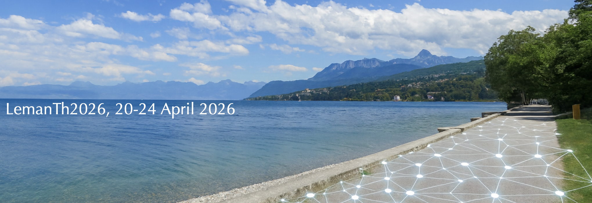

<section id="about" class="section">

# LemanTh 2026

After two successful editions in 2024 and 2025, we are delighted to announce the third edition of the **Lausanne Event on Machine Learning and Neural Network Theory (LemanTh)**, which will be held at the Bernoulli Centre at EPFL from **20–24 April 2026**.

Over the past decade, machine learning has undergone a remarkable transformation: algorithms now tackle problems and process volumes of data that, not long ago, belonged to the realm of science fiction. This year’s program will focus on the theoretical foundations of machine learning and neural networks, and their deep connections with high-dimensional statistics, statistical physics, and computer science. It will foster discussions at the crossroads of probability theory, statistical physics, optimization, and theoretical computer science.

</section>

<section id="schedule" class="section">

## Schedule

TBA

</section>

<section id="registration" class="section">

## Registration

TBA

</section>

<section id="venue" class="section">

## Venue

[Bernoulli Center](https://bernoulli.epfl.ch/), EPFL, Lausanne.

</section>

<section id="speakers" class="section">

## Invited speakers

TBA

</section>

<section id="organisers" class="section">

## Organisers

Florent Krzakala (EPFL, IdePhics Lab.), and Bruno Loureiro (DI-ENS &amp; CNRS)

</section>
